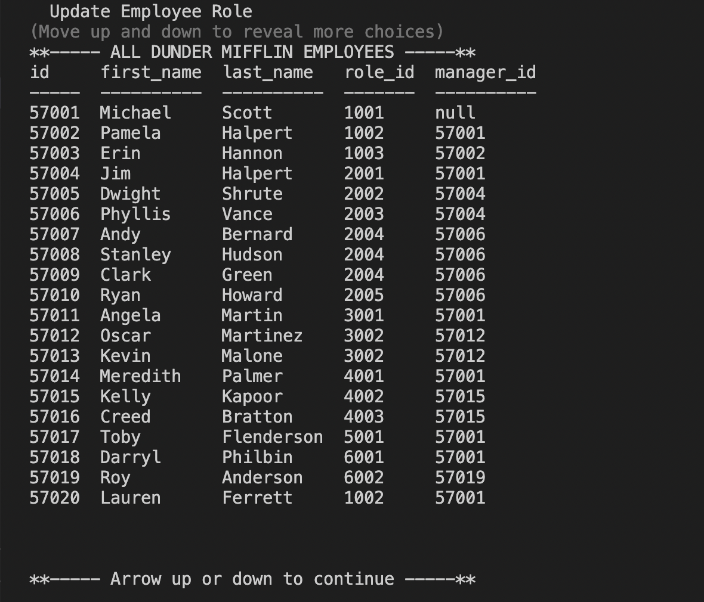

# Dunder Mifflin Employee Tracker

## Description

This app creates a content management system that allows Dunder Mifflin administration to manage the employee directory. Running in the command line, it allows users to view all departments, view all roles, view all employees, add a department, add a role, add an employee, and update an employee role. 

## Table of Contents

- [Installation](#installation)
- [Usage](#usage)
- [Credits](#credits)
- [License](#license)
- [Questions](#questions)

## Installation

To run the app locally, clone the repository to your local development environment. Run npm install to install all dependencies. Source both the schema and seeds SQL files. In a command terminal, navigate to the correct directory and run the application using the command 'npm start'.

## Usage

A video walk through of the final project is below:

[Video Walkthrough](https://drive.google.com/file/d/1_EW5BJspHMWlEKekBMs8exYUDGV6ylAx/view?usp=sharing)

## Credits

Coding was completed by Lauren Ferrett, using references from class activities.

## License

MIT License

Copyright (c) 2022 Lauren Ferrett

Permission is hereby granted, free of charge, to any person obtaining a copy
of this software and associated documentation files (the "Software"), to deal
in the Software without restriction, including without limitation the rights
to use, copy, modify, merge, publish, distribute, sublicense, and/or sell
copies of the Software, and to permit persons to whom the Software is
furnished to do so, subject to the following conditions:

The above copyright notice and this permission notice shall be included in all
copies or substantial portions of the Software.

THE SOFTWARE IS PROVIDED "AS IS", WITHOUT WARRANTY OF ANY KIND, EXPRESS OR
IMPLIED, INCLUDING BUT NOT LIMITED TO THE WARRANTIES OF MERCHANTABILITY,
FITNESS FOR A PARTICULAR PURPOSE AND NONINFRINGEMENT. IN NO EVENT SHALL THE
AUTHORS OR COPYRIGHT HOLDERS BE LIABLE FOR ANY CLAIM, DAMAGES OR OTHER
LIABILITY, WHETHER IN AN ACTION OF CONTRACT, TORT OR OTHERWISE, ARISING FROM,
OUT OF OR IN CONNECTION WITH THE SOFTWARE OR THE USE OR OTHER DEALINGS IN THE
SOFTWARE.

## Questions
Any questions can be directed to lferrett@gmail.com
